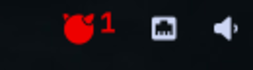

# RHEL — Omarchy bar plugin

Red Hat Enterprise Linux 10 (UBI) one click away, in the Omarchy bar.

> **Why this exists:** I have to practice RHEL 10 for work and wanted a
> separate, isolated environment to poke at without touching my main system —
> and I wanted it a single click from the bar instead of a `docker run` I had to
> remember. So I vibecoded it into an Omarchy plugin. It's a personal tool that
> grew a README; if it's useful to you too, enjoy.



The widget shows a Red Hat glyph in the bar (glowing red with a count when RHEL
containers are running). Click it for a popup that:

- **Shell** — attaches a terminal to a RHEL 10 container (`docker exec -it`),
  starting a stopped container first if needed
- **+ New Shell** — opens a fresh interactive RHEL 10 shell
- **Pin / Throwaway toggle** — controls what "+ New Shell" creates:
  - **Pinned (default):** the container runs *detached*, so closing the terminal
    just detaches it — it stays in the widget and you can `Shell` back into it later
  - **Throwaway:** `--rm`, so it disappears the moment you close the terminal
- **Start / Stop / Remove** — manage your RHEL containers without leaving the desktop
- **Rebuild Image** — pulls the latest public UBI base and rebuilds the CLI-ready
  image (adds `ncurses`, `vim-minimal`, `less` on top, because the stock UBI
  base has no `clear`)

When anything fails, the plugin tells you *what* went wrong and *how to fix it* —
both inline in the popup (e.g. a missing image, a wedged container) and in the
terminal for shell actions (missing image, dead Docker daemon, stale group perms).

## Requirements

- Docker installed and running: `sudo systemctl enable --now docker`
- No Red Hat login needed — the base is the public UBI image
  (`registry.access.redhat.com/ubi10/ubi`), free to pull.

## Install

```bash
omarchy plugin add https://github.com/arifahmed19/Plug-RHEL-10-Oma.git --enable
```

Then place the widget: `omarchy bar move arifahmed19.rhel --section right`
(or drag it in the bar settings).

## Settings

| Setting     | Default                                        | Purpose                          |
|-------------|------------------------------------------------|----------------------------------|
| `imageName` | `rhel10-cli`                                   | Local tag of the built image     |
| `baseImage` | `registry.access.redhat.com/ubi10/ubi:latest`  | Upstream base to build `FROM`    |

## How it works

`rhel.sh` is the action backend the QML widget calls:

- `state` — docker availability, image presence, RHEL release, container list
- `open <name>` / `run` — interactive shells via `xdg-terminal-exec`
- `start` / `stop` / `rm` — container lifecycle
- `rebuild` — generates a Dockerfile and builds the CLI image

If you recently ran `sudo usermod -aG docker $USER` but haven't logged back in,
the plugin falls back to `newgrp docker` automatically.

## Updating RHEL

Press **Rebuild Image** in the popup — it pulls the freshest UBI and rebuilds.

## License

MIT — see [LICENSE](LICENSE).
